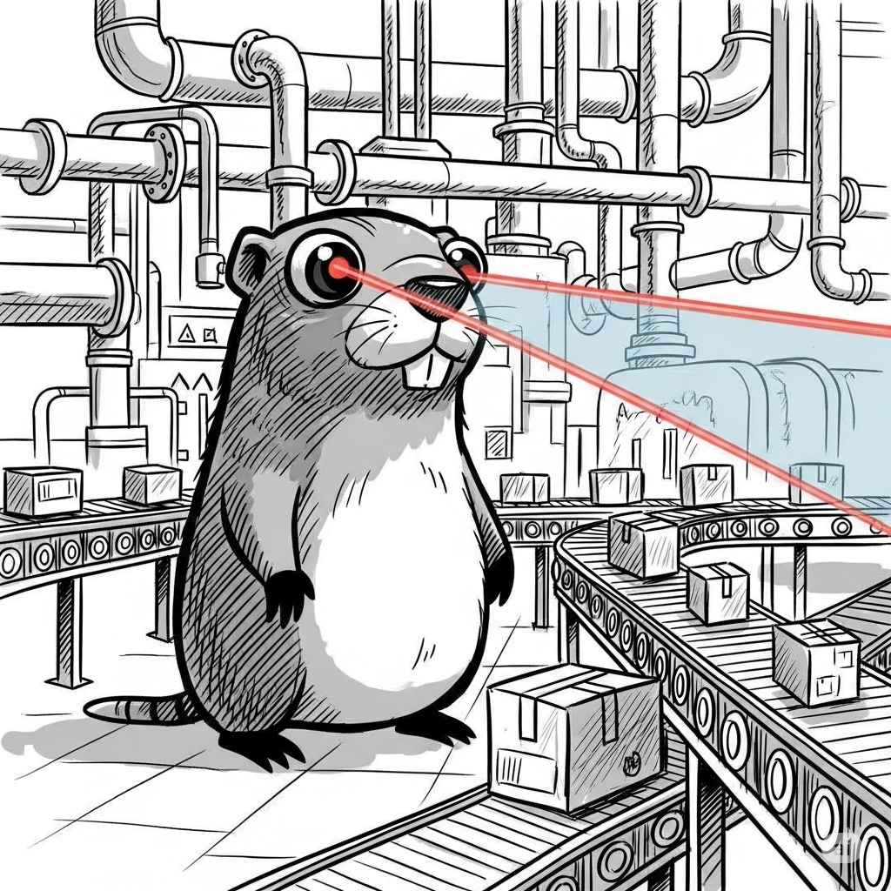

# Goverhaul

> High-performance Go architecture linter with watch mode for instant feedback

[](https://github.com/gophersatwork/goverhaul/actions?query=workflow%3A%22Run+Tests%22)
[](https://codecov.io/gh/gophersatwork/goverhaul)
[](https://goreportcard.com/report/github.com/gophersatwork/goverhaul)
[](https://godoc.org/github.com/gophersatwork/goverhaul)
[](https://github.com/gophersatwork/goverhaul/releases)



Goverhaul is a high-performance CLI tool to enforce architectural rules in Go projects. It helps teams maintain the intended architecture by defining and enforcing import boundaries between packages, with intelligent caching for blazing-fast analysis.

## Features

- Define allowed imports for specific package paths
- Define prohibited imports with explanatory causes
- Generate visual dependency graphs
- **High-performance caching** using MUS binary encoding
- **Incremental analysis** for fast subsequent runs
- **Watch mode** for continuous file monitoring with instant feedback
- Real-time violation detection with debouncing
- Config hot-reload for dynamic rule updates
- Simple YAML configuration
- Easy CI/CD integration

## Performance-First Design

Goverhaul uses **MUS (Marshal/Unmarshal/Size)** binary serialization for cache storage, delivering exceptional performance:

- **2,700+ MB/s** encoding throughput
- **1,000+ MB/s** decoding throughput
- **Single allocation** design for minimal GC pressure
- **Compact binary format** for efficient storage
- **Linear scalability** from small projects to enterprise monorepos

### Real-World Performance

| Project Size | Cache Write | Cache Read | Memory Usage |
|--------------|-------------|------------|--------------|
| Small (100 files) | <1ms | <1ms | Negligible |
| Medium (1,000 files) | ~100μs | ~200μs | <200KB |
| Large (10,000 files) | ~760μs | ~2ms | ~2MB |
| Enterprise (100,000 files) | ~7.4ms | ~14.3ms | ~20MB |

This means faster CI/CD pipelines, real-time IDE integration, and efficient analysis for projects of any size.

## Installation

### Using Go Install

```bash
go install github.com/gophersatwork/goverhaul@latest
```

### Using Go Tool Directive (Go 1.24+)

```bash
go get -tool github.com/gophersatwork/goverhaul@latest
```

### From Source

```bash
git clone https://github.com/gophersatwork/goverhaul.git
cd goverhaul
go build
```

## Quick Start

1. Install Goverhaul:
   ```bash
   go install github.com/gophersatwork/goverhaul@latest
   ```

2. Create a `.goverhaul.yml` configuration:
   ```yaml
   # Enable high-performance incremental analysis
   incremental: true
   cache_file: ".goverhaul.cache"

   rules:
     # Domain layer should not depend on infrastructure
     - path: "internal/domain"
       prohibited:
         - name: "internal/infrastructure"
           cause: "Domain should not depend on infrastructure"

     # API layer should not access database directly
     - path: "internal/api"
       prohibited:
         - name: "internal/database"
           cause: "API should access database through domain services"
   ```

3. Run Goverhaul:
   ```bash
   goverhaul --path . --config .goverhaul.yml
   ```

4. Subsequent runs use the cache for instant results!

## Usage

### Basic Usage

```bash
# Run with default configuration
goverhaul --path . --config .goverhaul.yml

# Enable verbose logging
goverhaul --path . --config .goverhaul.yml --verbose

# Analyze specific directory
goverhaul --path ./internal --config .goverhaul.yml

# Group violations by rule instead of file
goverhaul --path . --config .goverhaul.yml --group-by-rule

# Control colored output
goverhaul --path . --config .goverhaul.yml --color=always  # or never, auto
```

### Watch Mode - Continuous Monitoring

Watch mode continuously monitors your Go files for changes and automatically re-runs the linter when changes are detected:

```bash
# Watch current directory
goverhaul watch

# Watch specific path
goverhaul watch --path ./internal

# Custom config
goverhaul watch --config .goverhaul.yml

# Combine with other options
goverhaul watch --path . --group-by-rule --verbose
```

**Watch Mode Features:**
- **Real-time file monitoring** using fsnotify
- **Intelligent debouncing** groups rapid changes (100ms window)
- **Incremental analysis** - only re-analyzes changed files
- **Config hot-reload** - automatically reloads and re-analyzes when config changes
- **Beautiful colored output** with progress indicators
- **Sub-100ms analysis time** thanks to MUS cache
- **Graceful shutdown** with Ctrl+C

**Example Watch Session:**

```
╭─────────────────────────────────────────────────────╮
│  Goverhaul Watch Mode                               │
╰─────────────────────────────────────────────────────╯

✅ No violations found

👀 Watching /home/user/project for changes...
Press Ctrl+C to stop

[13:45:23] 📝 internal/api/handler.go changed
[13:45:23] ⚡ Re-analyzing 1 file...
[13:45:23] ✅ No violations found

[13:46:15] 📝 internal/domain/user.go changed
[13:46:15] ⚡ Re-analyzing 1 file...
[13:46:15] ❌ Found 1 violation

  📁 internal/domain/user.go
     (1 violations)

     ❌ import "internal/infrastructure" · line 5:2
        Rule: domain-no-infra
        Severity: error
        Domain should not depend on infrastructure
```

### Command Line Options

- `--path`: Path to analyze (default: ".")
- `--config`: Configuration file path (default: "$HOME/.goverhaul.yml")
- `--verbose`: Enable verbose logging for debugging
- `--group-by-rule`: Group violations by rule instead of file
- `--color`: When to use colors: auto, always, never (default: "auto")

## Configuration

Goverhaul uses YAML for configuration. Here's a complete example:

```yaml
# Path to go.mod file
modfile: "go.mod"

# Enable incremental analysis with high-performance MUS caching
incremental: true

# Cache file location (uses MUS binary encoding)
cache_file: ".goverhaul.cache"

rules:
  # Core business logic isolation
  - path: "internal/core"
    allowed:
      - "context"
      - "errors"
      - "fmt"
      - "time"
      - "internal/core"
    prohibited:
      - name: "internal/api"
        cause: "Core should not depend on API layer"
      - name: "internal/db"
        cause: "Core should not depend on database layer"

  # API layer constraints
  - path: "internal/api"
    prohibited:
      - name: "internal/db"
        cause: "API should access database through core interfaces"
```

### Configuration Options

- **modfile**: Path to go.mod file (default: "go.mod")
- **incremental**: Enable incremental analysis for faster runs (default: false)
- **cache_file**: Cache file location (default: "$HOME/.goverhaul/cache.json")
- **rules**: List of architectural rules
  - **path**: Package path to apply the rule to
  - **allowed**: Whitelist of permitted imports
  - **prohibited**: Blacklist of forbidden imports
    - **name**: Package name to prohibit
    - **cause**: Explanation for the prohibition

## High-Performance Caching

Goverhaul's caching system uses **MUS binary encoding** for exceptional performance:

### Why MUS?

- **Minimal allocations**: Single allocation per operation
- **Excellent throughput**: 2,700+ MB/s encoding, 1,000+ MB/s decoding
- **Compact size**: Efficient varint encoding for small cache files
- **Linear scalability**: Consistent performance from 10 to 100,000 files

### Cache Benefits

1. **First run**: Analyzes all files and builds the cache
2. **Subsequent runs**: Only analyzes changed files
3. **CI/CD**: Dramatically reduced build times
4. **IDE integration**: Real-time feedback with minimal overhead

### Cache Location

By default, the cache is stored in `$HOME/.goverhaul/cache.json`. You can customize this:

```yaml
cache_file: ".goverhaul.cache"  # Project-local cache
```

Or use an absolute path:

```yaml
cache_file: "/tmp/goverhaul.cache"  # Temporary cache
```

## Architecture Patterns

### Clean Architecture

```yaml
rules:
  # Domain entities: no external dependencies
  - path: "internal/domain"
    allowed:
      - "fmt"
      - "errors"
      - "context"
      - "time"

  # Use cases: depend on domain only
  - path: "internal/usecase"
    allowed:
      - "fmt"
      - "errors"
      - "context"
      - "internal/domain"
    prohibited:
      - name: "internal/infrastructure"
        cause: "Use cases should depend on interfaces, not implementations"

  # Infrastructure: implements interfaces
  - path: "internal/infrastructure"
    prohibited:
      - name: "internal/usecase"
        cause: "Infrastructure should not depend on use cases"
```

### Hexagonal Architecture

```yaml
rules:
  # Core domain: completely isolated
  - path: "pkg/core"
    prohibited:
      - name: "pkg/api"
        cause: "Core should not depend on adapters"
      - name: "pkg/db"
        cause: "Core should not depend on adapters"
      - name: "pkg/messaging"
        cause: "Core should not depend on adapters"

  # Adapters: can use core
  - path: "pkg/api"
    prohibited:
      - name: "pkg/db"
        cause: "Adapters should not depend on each other"
```

### Layered Architecture

```yaml
rules:
  # Presentation layer
  - path: "internal/presentation"
    prohibited:
      - name: "internal/data"
        cause: "Presentation should access data through business layer"

  # Business layer
  - path: "internal/business"
    prohibited:
      - name: "internal/presentation"
        cause: "Business should not depend on presentation"

  # Data layer
  - path: "internal/data"
    prohibited:
      - name: "internal/business"
        cause: "Data should not depend on business"
      - name: "internal/presentation"
        cause: "Data should not depend on presentation"
```

## CI/CD Integration

### GitHub Actions

```yaml
name: Architecture Check

on:
  push:
    branches: [ main ]
  pull_request:
    branches: [ main ]

jobs:
  goverhaul:
    runs-on: ubuntu-latest
    steps:
    - uses: actions/checkout@v3

    - name: Set up Go
      uses: actions/setup-go@v4
      with:
        go-version: '1.24'

    - name: Install Goverhaul
      run: go install github.com/gophersatwork/goverhaul@latest

    - name: Cache Goverhaul results
      uses: actions/cache@v3
      with:
        path: .goverhaul.cache
        key: goverhaul-${{ hashFiles('**/*.go') }}
        restore-keys: goverhaul-

    - name: Check architecture
      run: goverhaul --path . --config .goverhaul.yml
```

### GitLab CI

```yaml
architecture-check:
  stage: test
  image: golang:1.24
  script:
    - go install github.com/gophersatwork/goverhaul@latest
    - goverhaul --path . --config .goverhaul.yml
  cache:
    key: goverhaul-${CI_COMMIT_REF_SLUG}
    paths:
      - .goverhaul.cache
```

## Use Cases

### Enforcing Clean Architecture

Maintain the dependency rule:
- Domain entities have no external dependencies
- Use cases depend only on domain entities
- Adapters depend on use cases but not frameworks
- Frameworks are isolated at the boundaries

### Maintaining Module Boundaries

For multi-module projects:
- Define clear boundaries between modules
- Enforce API contracts
- Prevent implementation leakage

### Controlling Dependencies

Limit external dependency spread:
- Restrict third-party library usage
- Isolate framework dependencies
- Keep core business logic clean

### Documenting Architecture

Use rules as executable documentation:
- Encode architectural decisions
- Make constraints visible
- Help new team members

## Best Practices

### 1. Start with Critical Boundaries

Focus on the most important architectural constraints first:
```yaml
rules:
  # Start here: protect core business logic
  - path: "internal/domain"
    prohibited:
      - name: "external/dependencies"
        cause: "Domain should be framework-agnostic"
```

### 2. Enable Incremental Analysis

For large projects, always enable caching:
```yaml
incremental: true
cache_file: ".goverhaul.cache"
```

This dramatically reduces analysis time for subsequent runs.

### 3. Use Meaningful Causes

Make violations easy to understand:
```yaml
prohibited:
  - name: "internal/db"
    cause: "API layer should access database through repository interfaces defined in domain layer"
```

### 4. Version Control Your Configuration

Commit `.goverhaul.yml` to track architectural decisions over time.

### 5. Integrate Early

Add Goverhaul to CI/CD pipelines early to prevent architectural drift.

## Troubleshooting

### Rule Not Applied

**Issue**: Rule doesn't seem to work.

**Solutions**:
- Verify path matches your package structure
- Use `--verbose` to see which files are analyzed
- Check package declarations in Go files

### Cache Issues

**Issue**: Incremental analysis not detecting changes.

**Solutions**:
- Delete cache file and run again
- Verify cache file location is correct
- Ensure file permissions allow cache writes

### CI/CD Failures

**Issue**: Works locally but fails in CI.

**Solutions**:
- Verify Go version matches
- Check configuration file is in repository
- Use absolute paths in CI configuration
- Add `--verbose` for debug output

## Performance Tips

### For Large Codebases

1. **Enable incremental analysis**: Mandatory for 1,000+ files
2. **Use local cache**: Place cache in project directory
3. **Fast storage**: Put cache on SSD/NVMe
4. **Parallel CI**: Cache persists across builds

### For Maximum Speed

1. **Pre-allocate cache**: First run may be slower, subsequent runs are instant
2. **Network storage**: Avoid network-mounted cache locations
3. **Memory**: More RAM helps for very large projects (100,000+ files)

## Examples

Check the [examples directory](examples/) for complete examples:
- **layered-architecture**: Three-tier architecture enforcement
- **microservices**: Service boundary enforcement
- **monolith**: Module isolation in monolithic applications

## Contributing

Contributions are welcome! Please feel free to open a discussion or PR.

See [CONTRIBUTING.md](CONTRIBUTING.md) for guidelines.

## License

GNU General Public License (GPL v3)

## Technical Details

For implementation details about the high-performance MUS cache, see [IMPLEMENTATION_SUMMARY.md](IMPLEMENTATION_SUMMARY.md).
